# Capstone Project - HealthSync


Repositori ini dibuat untuk memenuhi tugas **Capstone Project** Program Studi Sistem Informasi tahun 2026. Proyek ini menampilkan **HealthSync**, aplikasi pemantau kesehatan harian berbasis web yang membantu pengguna memantau kebutuhan hidrasi dan kualitas tidur secara personal, berdasarkan berat badan, usia, dan tingkat aktivitas.

🌐 **Live Demo:** [healthsync.tyass.my.id](https://healthsync.tyass.my.id)

## 📷 Tampilan Web HealthSync 

### Halaman Depan & Informasi
| Landing Page | About Us |
| :---: | :---: |
| 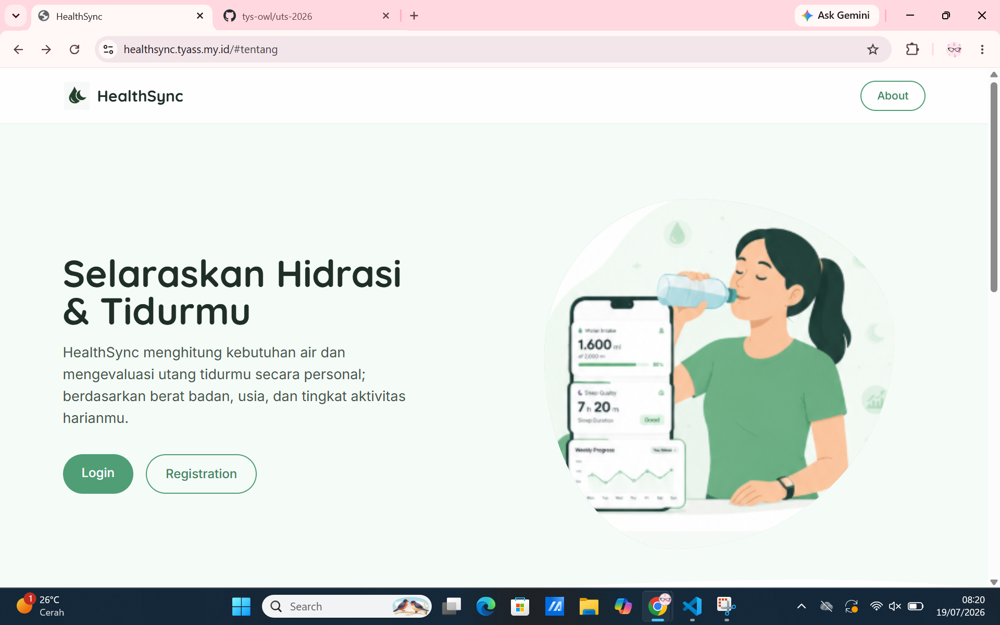 | 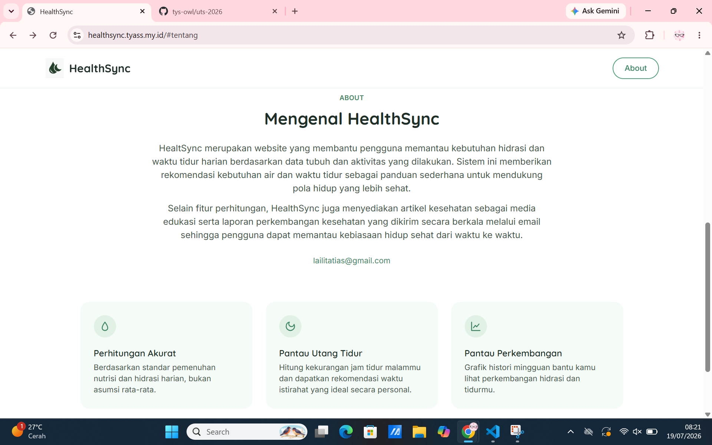 |

### Akses & Dashboard Pengguna
| Register | Login | Dashboard Utama |
| :---: | :---: | :---: |
| 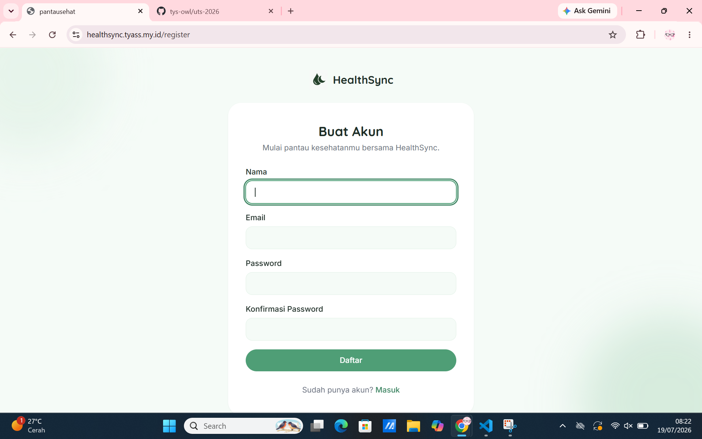 | 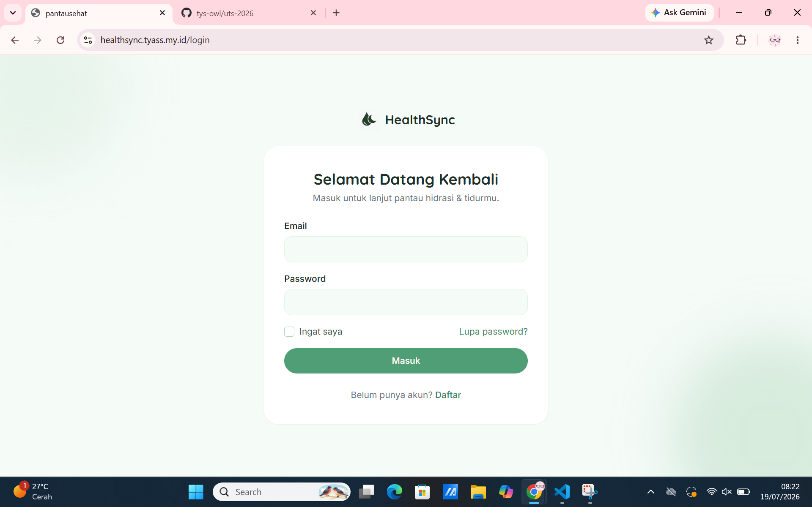 | 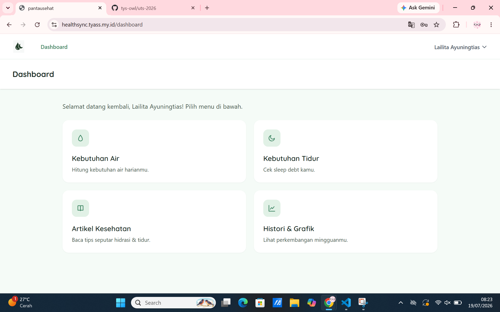 |

### Fitur Kalkulator & Laporan
| Kalkulator Air | Kalkulator Tidur | Laporan Mingguan |
| :---: | :---: | :---: |
| 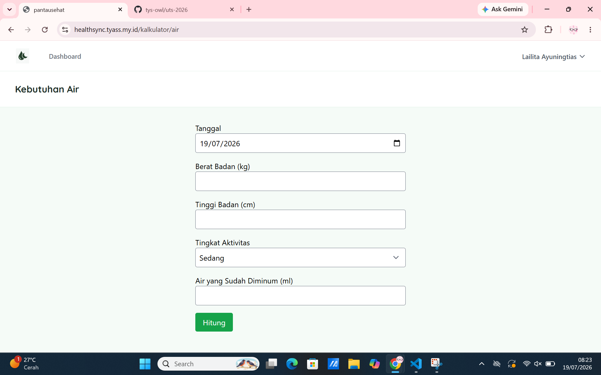 | 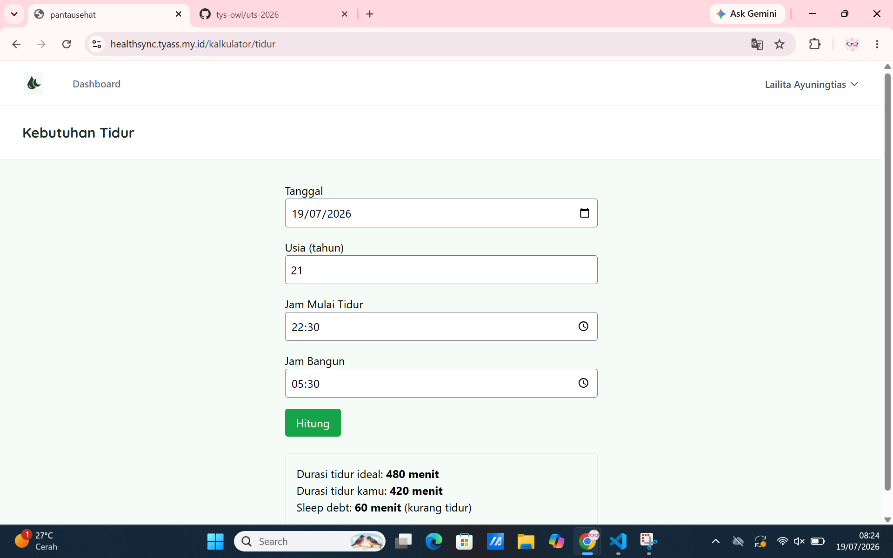 | 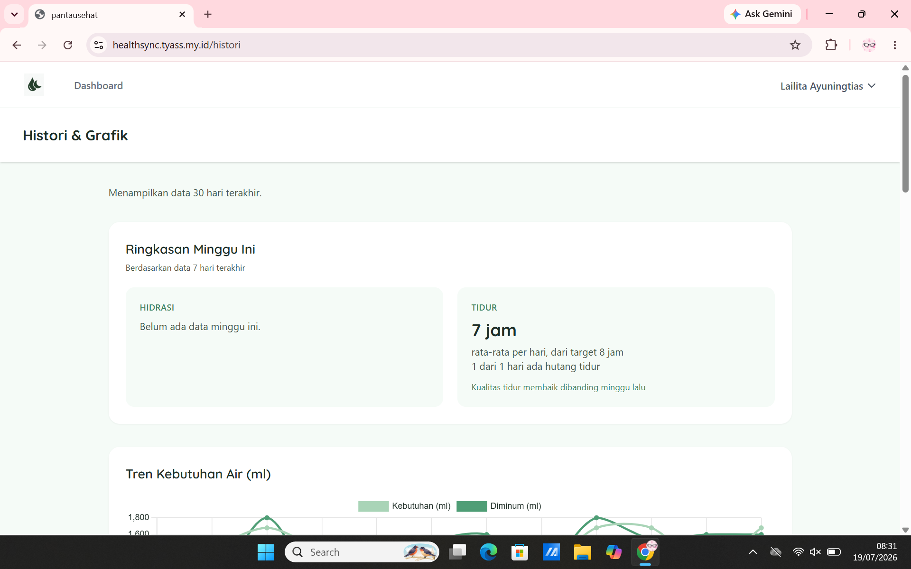 |

### Analisis & Artikel Kesehatan
| Grafik Kesehatan | Riwayat Log | Daftar Artikel | Detail Artikel |
| :---: | :---: | :---: | :---: |
| 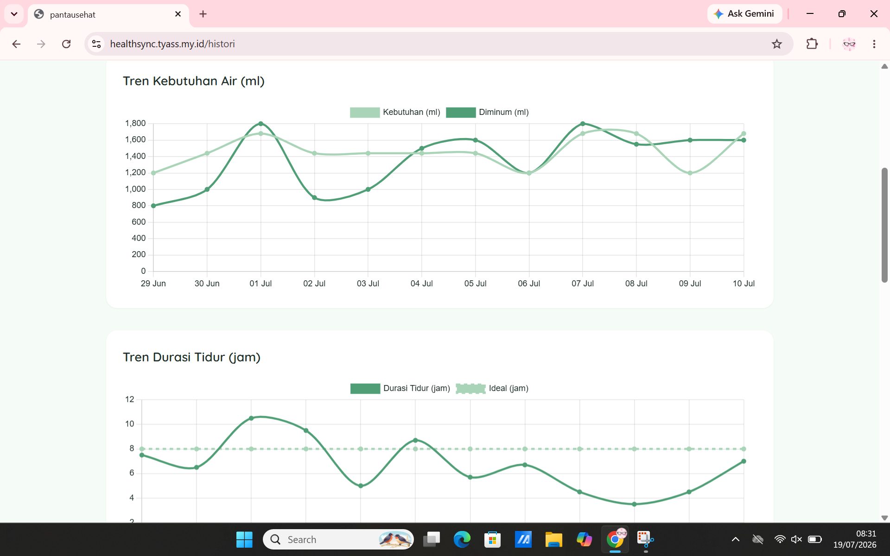 | 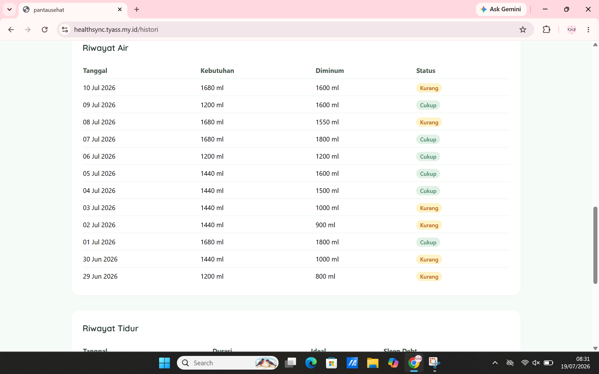 | 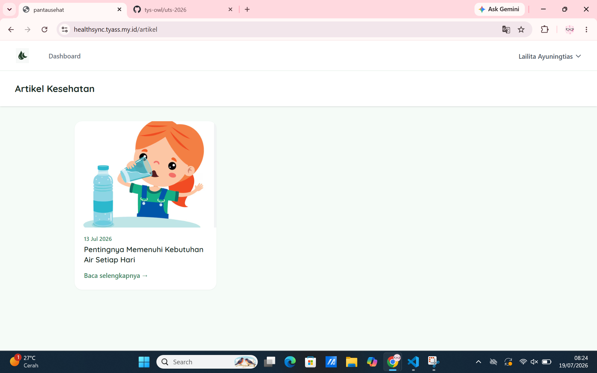 | 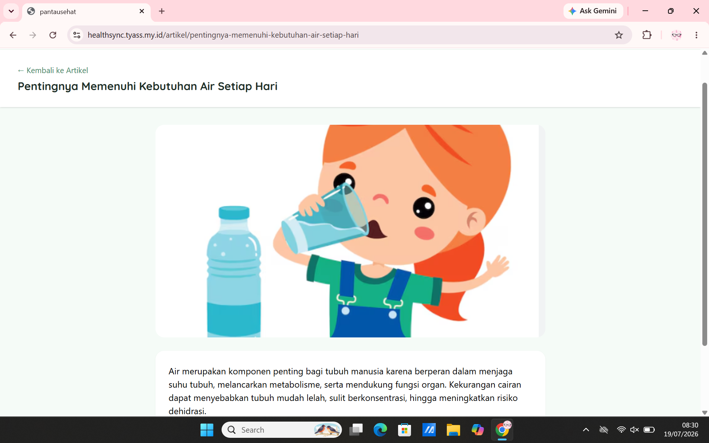 |

### Filament Admin Panel
| Dashboard Admin | CRUD Artikel | Web Setting (About) |
| :---: | :---: | :---: |
| 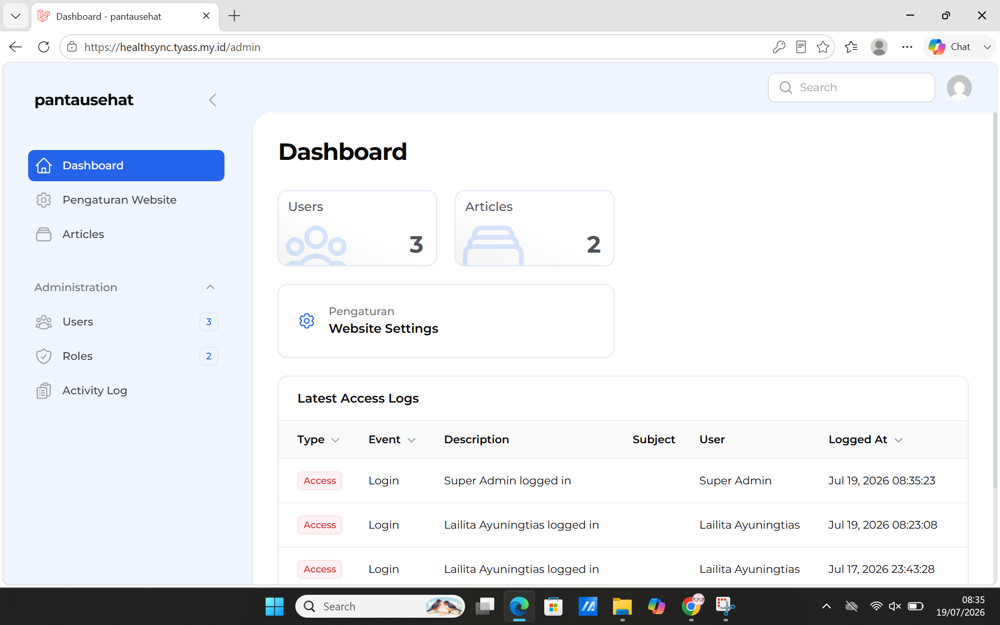 | 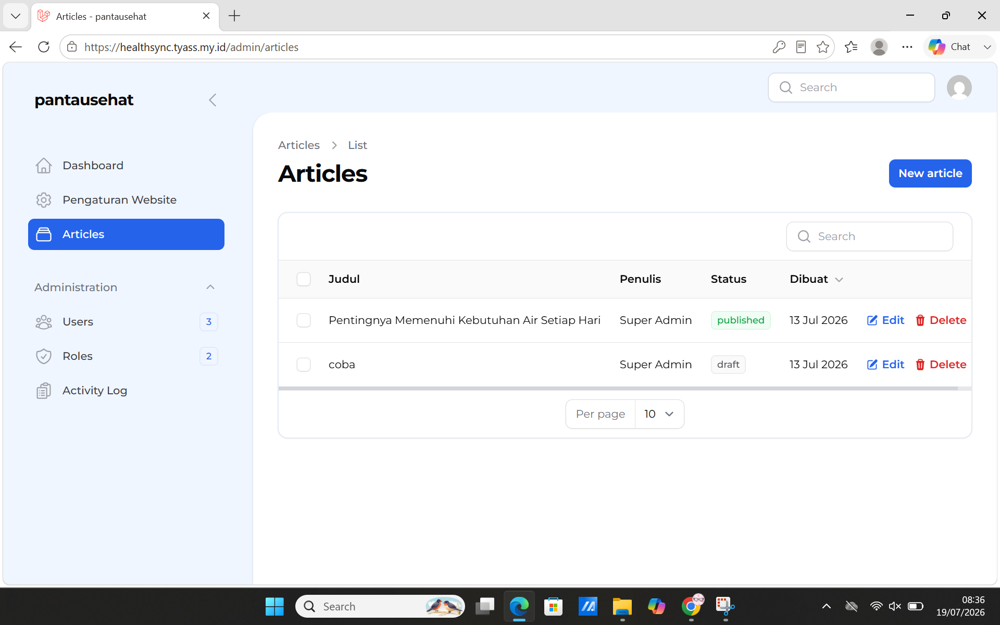 | 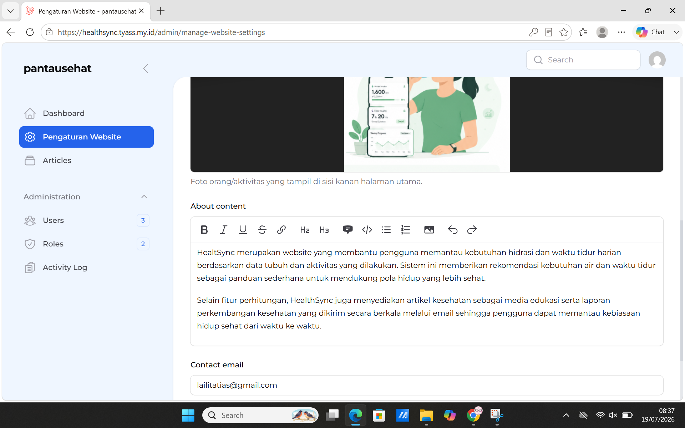 |

## 🛠️ Fitur Utama
- **Hydration Tracker:** Kalkulasi kebutuhan air minum harian secara personal.
- **Sleep Quality Log:** Pencatatan dan evaluasi utang tidur harian.
- **Data Visualization:** Grafik riwayat & tren hidrasi/tidur (Chart.js).
- **Manajemen Artikel Kesehatan:** CRUD artikel (judul, isi, gambar, status publikasi) lewat panel admin.
- **Manajemen Informasi Website:** Pengaturan halaman About, visi-misi, dan logo sistem.
- **Role & Permission:** Manajemen hak akses pengguna berbasis role (Spatie Permission + Filament Shield).
- **REST API:** Endpoint API untuk integrasi data kesehatan.
- **Desain Responsif:** Tampilan menyesuaikan ukuran layar (HP, tablet, laptop).

## 🚀 Teknologi yang Digunakan
- **Frontend:** Blade Templating Engine, Livewire, Tailwind CSS
- **Backend:** PHP 8.3 (Laravel 12, Filament v3)
- **Database:** MariaDB 10.11
- **Deployment:** Docker Compose, Nginx (reverse proxy), VPS dengan hosting subdomain

## ⚙️ Instalasi Lokal

```bash
git clone https://github.com/tys-owl/pantausehat-2026.git healthsync
cd healthsync
cp src/.env.example src/.env
docker compose up -d --build
docker compose exec php php artisan key:generate
docker compose exec php php artisan migrate --seed
docker compose exec php php artisan storage:link
```

Akses lewat `http://localhost` (sesuaikan port di `docker-compose.yml` kalau perlu).

## 👤 Penulis
- **Nama:** Lailita Ayuninigtias
- **NIM:** 20240803102
- **Program Studi:** Sistem Informasi
